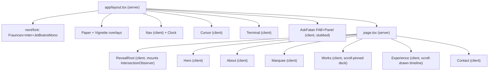

## Earth-edition Portfolio — Implementation Plan

### Stack & Approach
- Next.js 16 App Router (already scaffolded), React 19 **functional components only**, TypeScript.
- Author styles with **CSS Modules** per section + a single `globals.css` for CSS-variable tokens, base resets, paper/vignette overlays, and the `reveal-line / reveal-word / reveal-fade` primitives. The design relies on deeply-scoped CSS-var-driven selectors which map cleanly to modules and would fight Tailwind utilities. Keep `@import "tailwindcss"` available (already installed) but don't author with it.
- Replace the prototype's runtime React/Babel CDN + `<style>{...}</style>` blocks with native Next compilation.
- Fonts via `next/font/google` for **Fraunces**, **Inter**, **JetBrains Mono** — exposed as `--serif / --sans / --mono` CSS variables (matches the prototype's contract).
- Portrait via `next/image` from `public/profile.png` (copied from `docs/my-portfolio/project/src-v2/profile.png`).
- Server component shell (`layout.tsx`, `page.tsx`); each interactive section is `'use client'` because every one uses refs, scroll listeners, or IntersectionObserver.

### Design Tokens (locked palette — Clay accent + Sand tone, custom cursor on)
Locked per the user's tweak selection. The Sand tone values come from [tweaks.js](docs/my-portfolio/project/src-v2/tweaks.js) line 21 (the `sand` entry); the Clay accent is `#A0785A` from [tweaks.js](docs/my-portfolio/project/src-v2/tweaks.js) line 13. Bake them into `globals.css` once — no theme-switching code:

```css
:root {
  /* Sand tone */
  --bg:        #EDE8E2;
  --bg-2:      #E4DED5;
  --cream:     #F5F1EA;
  --fg:        #2C2825;
  --fg-dim:    #6B635A;
  --fg-muted:  #9C9489;
  --line:        rgba(44, 40, 37, 0.09);
  --line-strong: rgba(44, 40, 37, 0.20);

  /* Clay accent */
  --accent: #A0785A;

  /* Type stacks fed by next/font CSS variables */
  --serif: var(--font-fraunces, 'Fraunces', 'Times New Roman', serif);
  --sans:  var(--font-inter, 'Inter', ui-sans-serif, system-ui, sans-serif);
  --mono:  var(--font-jetbrains, 'JetBrains Mono', ui-monospace, 'SF Mono', monospace);
}
```

Note the prototype's base `:root` (Parchment) at [index-v2.html](docs/my-portfolio/project/index-v2.html) lines 11-25 is **not** what we ship — it gets overridden by Sand at runtime in the prototype, and we collapse that to a single set of tokens here.

Custom cursor is **on by default** — body sets `cursor: none` and the `<Cursor/>` component renders the dot + ring (matches the user's "Custom" selection).

### File Layout

All folder + file names are **lowercase with `-` separators** (component default exports stay PascalCase inside the files):

```
src/
  app/
    layout.tsx              # fonts, <html lang>, paper+vignette overlays, mounts <Cursor/>, <Nav/>, <Terminal/>, <AskFatan/>
    page.tsx                # composes Hero -> About -> Marquee -> Works -> Experience -> Contact
    globals.css             # tokens, resets, paper/vignette, reveal primitives, scrollbar hide
  components/
    nav/{nav.tsx, clock.tsx, nav.module.css}
    hero/{hero.tsx, hero.module.css}
    about/{about.tsx, about.module.css}
    marquee/{marquee.tsx, marquee.module.css}
    works/{works.tsx, motif.tsx, data.ts, works.module.css}
    experience/{experience.tsx, data.ts, experience.module.css}
    contact/{contact.tsx, contact.module.css}
    cursor/{cursor.tsx, cursor.module.css}
    terminal/{terminal.tsx, terminal.module.css}
    ask-fatan/{ask-fatan.tsx, ask-fatan.module.css, prompt.ts}   # UI only, TODO marker
    reveal/{reveal-root.tsx}                                     # client wrapper that mounts the IntersectionObserver
  hooks/
    use-reveal.ts            # IntersectionObserver -> add `.in` (ports utils.js observeReveals)
    use-jkt-clock.ts         # ticking JKT-formatted time
public/
  profile.png                # copied from docs/my-portfolio/project/src-v2/profile.png
```

### Section-by-Section Mapping

- **Nav** ([index-v2.html](docs/my-portfolio/project/index-v2.html) lines 283-295): brand mark + 4 anchor links + live JKT clock pip. Clock uses `useJktClock` (ports `startClock` from [utils.js](docs/my-portfolio/project/src-v2/utils.js)).
- **Hero** ([hero.jsx](docs/my-portfolio/project/src-v2/hero.jsx)): full-vh stage with the architectural sun motif (24 ticks, 3 rings, meridian, coord labels), centered portrait with parallax, oversized serif name `Fatan <em>Aminullah</em>`, mono subtitle, italic tagline, two corner meta blocks, scroll cue. Two `mousemove` parallax effects on `sunRef` + `photoRef`. Reveal classes fire on mount.
- **About** ([about.jsx](docs/my-portfolio/project/src-v2/about.jsx)): two-column grid; left = label/copy/sub/signature, right = sticky bento (5 cells incl. a wide quote cell). Reveal-fade on cells with stagger via `data-delay`.
- **Marquee** ([marquee.jsx](docs/my-portfolio/project/src-v2/marquee.jsx)): two infinite horizontal rows running opposite directions (`slide-left` 48s / `slide-right` 56s), pause on hover. Tech arrays inline.
- **Works** ([works.jsx](docs/my-portfolio/project/src-v2/works.jsx)) — most complex section:
  - 6 projects in `data.ts`, each with motif kind. Heights container to `total * 100vh`; inner `.pin` is `position:sticky;top:0`.
  - Scroll listener computes progress through the pinned region and sets `active` index (each card = one viewport of scroll).
  - Cards layered absolutely with `transform-style: preserve-3d`. Active card centered/flat; others fanned with rotation + Z-offset based on `(i - active + total) % total`.
  - Tab strip + prev/next arrows + progress bar + "Visit" CTA. Arrow keys jump scroll.
  - `Motif.tsx` ports the 7 inline SVGs (bottle, grid, film, mountain, crest, stamps).
- **Experience** ([experience.jsx](docs/my-portfolio/project/src-v2/experience.jsx)): vertical timeline with a `.spine` (1px line) and an animated `.draw` whose height is set by scroll progress; each `.entry::before` dot toggles `.done` / `.active` based on a scroll threshold. Three companies in `data.ts`.
- **Contact** ([contact.jsx](docs/my-portfolio/project/src-v2/contact.jsx)): giant heading "Let's build something *together*", primary CTAs, 4 link pills, 4-col colophon, foot bar with `Ctrl+` ` hint chip.

### Global Overlays & Interactivity

- **Paper texture + vignette** ([index-v2.html](docs/my-portfolio/project/index-v2.html) lines 39-48): two fixed `<div>`s in `layout.tsx`. The paper uses a base64 inline-SVG fractalNoise filter (port verbatim).
- **Custom cursor** ([cursor.js](docs/my-portfolio/project/src-v2/cursor.js)): `Cursor.tsx` client component with `dot` + `ring`, lerped position via `requestAnimationFrame`, listens for `mouseover` on `[data-cursor]` to set `data-variant`. Hidden when `(hover: none)`. Set `body { cursor: none }` only when active.
- **Reveal hook** (`hooks/use-reveal.ts`): mirrors [utils.js](docs/my-portfolio/project/src-v2/utils.js) `observeReveals` — observes `.reveal-line / .reveal-word / .reveal-fade` and toggles `.in` with `data-delay` stagger. Mounted once at the top of `page.tsx` via `components/reveal/reveal-root.tsx`.
- **Terminal overlay** ([terminal.js](docs/my-portfolio/project/src-v2/terminal.js)): `Terminal.tsx` client component. Listens for `Ctrl/Cmd + ``, toggles fixed-inset overlay, ASCII banner + commands map (`help/about/skills/projects/experience/contact/mode/clear`). Implemented as React state instead of mutating innerHTML.
- **Ask Fatan FAB + panel** ([ask.js](docs/my-portfolio/project/src-v2/ask.js)) — **stubbed for v1**:
  - Render the FAB pill (with pulse) and slide-out panel UI exactly per the prototype (suggested chips, intro greeting, message bubbles, input form, close button, ESC to close).
  - Submit handler is a single function `askFatan(question)` in [src/components/ask-fatan/ask-fatan.tsx](src/components/ask-fatan/ask-fatan.tsx) marked with `// TODO(LLM): replace stub with /api/ask call`. Stub returns a friendly "AI integration coming soon — email fatan.aminullah.j@gmail.com" message after a short artificial thinking delay so the typing-dots animation is visible.
  - Keep the system-prompt context string from `ask.js` (lines 17-26) in `src/components/ask-fatan/prompt.ts` so it ships with the eventual API route.

### Skipped from prototype
- **Tweaks panel** ([tweaks.js](docs/my-portfolio/project/src-v2/tweaks.js)) — fully removed. We ship the user-selected Clay accent + Sand tone with custom cursor on; CSS vars baked once into `globals.css`, no localStorage, no postMessage bridge.
- The `<script src="three.min.js">` import is present in `index-v2.html` but never used by any component — drop it.
- The runtime React/ReactDOM/Babel UMD scripts (replaced by Next compilation).
- The `parent.postMessage(...)` edit-mode bridge in `tweaks.js`.

### Layout flow



### Verification (manual, no automated tests added)
- `npm run dev` and visually compare each section against the prototype HTML with **Clay accent + Sand tone** selected in the prototype's tweaks panel (the locked-in target).
- `npm run build` to ensure no SSR/CSR boundary errors.
- `npm run lint` clean.
- Spot-check responsive breakpoints (`@media (max-width: 900px)` / `720px`) defined per section.
- Touch device check: cursor + parallax disabled when `(hover: none)`.